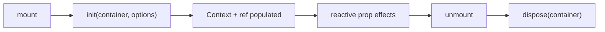

Understanding a few core ideas makes the rest of the API intuitive.

## The chart lifecycle

`<KLineChart>` does three things:

1. **Mount** — calls `init(container, options)` and stores the `Chart` instance. A forwarded `ref` and React context are populated.
2. **Update** — each reactive prop has its own `useEffect` that calls the matching KlineCharts setter only when the prop is defined and changes.
3. **Unmount** — calls `dispose(container)`. Because React unmounts children before parents, indicators/overlays/axes clean up *before* the chart is disposed.



The init effect is **mount-only** — `options` is applied once and intentionally *not* a reactive dependency. Changing `options` after mount has no effect; use the specific reactive props instead.

## StrictMode safety

React 18+ StrictMode runs effects twice in development (mount → cleanup → mount). The wrapper is StrictMode-safe: the cleanup disposes the chart and nulls the internal ref, so the second mount always starts from a clean state. No special handling is required in your code.

## Reactive props vs. init-only options

| Category        | When it's applied          | Examples                                            |
| --------------- | -------------------------- | --------------------------------------------------- |
| **Init-only**   | Once, on mount             | `options` (locale, timezone, styles, layout, …)     |
| **Reactive**    | On mount + whenever it changes | `styles`, `locale`, `timezone`, `zoomEnabled`, … |
| **Data**        | On mount + identity change | `data`, `dataLoader`, `symbol`, `period`            |
| **Events**      | Stable subscription        | `onZoom`, `onCrosshairChange`, …                    |

A reactive prop is only forwarded to KlineCharts when it's **not `undefined`** — so omitting a prop never resets a setting.

## The `data` prop identity

The `data` array's **identity** is the effect dependency:

```tsx
// ✅ Re-applies: new array reference
<KLineChart data={fetchResult} />

// ❌ Does not re-apply: same array, mutated in place
data.push(newBar);
```

For realtime/streaming updates, mutate-then-pass-a-new-reference, or — preferably — use a [`dataLoader`](../guide/data-loading/).

## Stable event subscriptions

Event callbacks are stored in a `ref` that's updated every render. This means you can pass an inline arrow function without causing re-subscriptions:

```tsx
// Safe — no re-subscribe churn, even though this is a new function each render
<KLineChart onCrosshairChange={(c) => console.log(c)} />
```

## Context

`<KLineChart>` provides a context holding the `Chart` instance (or `null` before init). All hooks and sub-components consume it via `useKLineChart()`. This is how a hook used in a deeply-nested child reaches the right chart without prop drilling.
